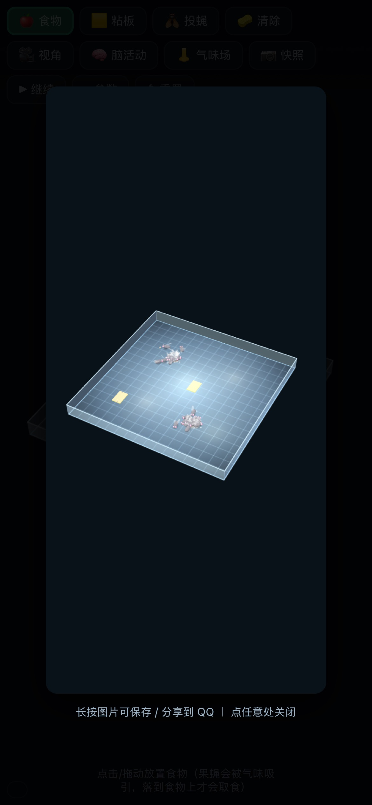

# 果蝇 3D 模拟器 · 实测连接组（FlyEM 雄性 CNS v1.0）

一个**纯前端、离线可跑**的果蝇自主行为模拟器：每只果蝇都有一副**从真实连接组降维出来的脉冲神经网络**（LIF），行为不是脚本写死的，而是从回路里长出来的。

## 数据来源（2026-09 最新）

**FlyEM 雄性 CNS v1.0** —— 2026 年 9 月由 HHMI Janelia FlyEM、剑桥 Connectomics Group 与 Google Research 联合发布：成虫雄性果蝇的**完整中枢神经系统**（脑 + 双侧视叶 + 腹神经索），**165,122 个已追踪神经元 / 25,568,639 条突触连接**，是迄今神经元数最多的脑图谱。

原始数据（公开桶，本模型直接读取聚合）：
`storage.googleapis.com/flyem-male-cns/v1.0/connectome-data/flat-connectome/`

- `body-annotations-…feather` — 每个神经元的细胞类型（16.5 万条）
- `body-neurotransmitters-…feather` — 递质预测（决定兴奋／抑制）
- `connectome-weights-…significant-only.feather` — 25,568,639 条连接（每行 = 一对神经元的突触数）

## 从 16.5 万神经元到每只 48 个：怎么降维的

| 步骤 | 做法 |
|---|---|
| 1 分组 | 按细胞类型归并成 25 个功能群（KC 4064、PN 808、MBON11 只有 2 个……真实数量全部保留在代码注释里） |
| 2 过滤 | 只保留 **≥5 突触/对** 的连接（FAFB/Codex 惯例，与 flybench 一致） |
| 3 权重 | **每后神经元突触数** = 该群对该神经元的总突触 ÷ 该群神经元数 —— 即"一个真实神经元能从这一群收到多少突触" |
| 4 压缩 | 实测扇入跨度达 1e4（48 ~ 104,640 突触），用 `min(5, log2(1+驱动/中位数))` 压缩，保留真实相对强度 |
| 5 自连接 | 群内自连接衰减到 0.15（约简模型会重复计入群体均值） |
| 6 增益 | 结构固定，只留**一个全局权重尺度 K**，按 flybench 反射判据标定 —— flybench 官方方法论 |

**145 条边中 119 条（82%）直接来自实测**，其余 26 条标注 `inf`，是为保留取食／饱足／饥饿驱动／转向行为而补的工程桥接。

### 实测数据纠正了我原来"手画"的接线

- **视觉 → 巨纤维逃逸**：实测为 **0**。真实逃逸通路是**听觉／机械（Johnston 器）→ DNp01**，**41.6 突触/对**
- **侧角 → 桥神经元／桥神经元 → 运动**：实测为 **0**。真实存在的是 **扇形体 → PFN**（15,518 条突触）
- **MBON11 拿到最强的惩罚多巴胺输入**（PPL1→MBON11 每对 **349 突触**）→ 模型里的"厌恶性读出"是**由数据选出来的**，不是我指定的
- **Hugin（4 个）、NPF（2 个）几乎没有快速突触输出** → 属多肽调质系统，因此按调质处理（与文献一致）
- 真实收敛度：KC→APL **50.9 突触/对**、ORN→PN **31.0**、PN→KC **19.3**

## 内建反射自检（对照 flybench 判据，5/5 通过）

| 检查 | 实测 |
|---|---|
| 静默 → 静默 | 0.00 Hz（判据 < 0.5 Hz） |
| 糖 → MN9 喙伸展 | 27 Hz（判据 > 5 Hz） |
| 警戒／厌恶抑制取食 | 0 Hz（判据 < 糖反应一半） |
| 机械／听觉 → 巨纤维逃逸 | 25 Hz（判据 > 10 Hz） |
| 气味 → 行进 | 31 Hz |

## 回路 → 行为

| 行为 | 通路 |
|---|---|
| 饥饿驱动觅食 | Hugin(SEZ) 调质 → 觅食增益↑、冒险性↑ |
| 气味吸引 | ORN_food/ORN_ferm → PN → LHON；PN → KC |
| **惩罚性学习** | 气味(CS，KC 活动) × PPL1 多巴胺 → **KC→MBON11 权重↑** → 从此绕行粘板 |
| 奖赏性学习 | GRN_sugar → PAM → KC→MBON03 权重↑ |
| 记忆消退 | 闻到气味但无惩罚 → 权重缓慢回落 |
| 警戒信息素避害 | 被粘个体释放 → 同伴 ORN_alarm → MBON11 → 回避＋抑制取食 |
| 逃逸反射 | 机械／听觉(JO) → DNp01/DNa（巨纤维）→ 腿部运动神经元爆发 |
| 取食 | GRN_sugar → MN9（喙伸展运动神经元，实测正好 2 个） |
| 转向 | PFN（扇形体桥神经元）↔ ring_EB（椭球体航向） |
| 稀疏编码 | KC → APL → KC 反馈抑制 |
| 饱足 | FB 扇形体（GABA 能）→ 抑制取食 |

## 食物消耗节奏（可实时调）

食物是**有限资源**：被取食按能量消耗、还会自然变质，归零即消失并留下残迹。

| 参数 | 含义 | 现默认 |
|---|---|---|
| `food.energy` | 一块新鲜食物的总能量 | **8000** |
| `food.decay` | 自然变质损耗（能量/s） | **12** |
| `food.consume` | 消耗系数：果蝇得 1 能量 = 食物减少多少 | **1.3** |
| `food.maxFeeders` | 同时"满速取食"的只数（人多则每只变慢） | **5** |

**实测节奏**（2 块食物，16 只起步）：一半被吃掉用 **51 秒**，全部吃光用 **111 秒**；
之后不再补充的话，种群会在 3 分钟内因饥饿衰减到 0。

想更快/更慢：网页 ⚙︎ 参数里直接拖 `food.energy`（越小越快）或 `food.consume`（越大越快），实时生效。

## 性能

48 神经元 / 25 群 / 667 条模型连接（实测 145 条边展开）；90 只果蝇时约 6.5 ms/帧。
果蝇数 > 70 自动降脑步频到每帧 1 步；老设备可下调 `pop.max`。

## 与其他开源果蝇模型的关系

| 项目 | 形态 | 本作的差别 |
|---|---|---|
| philshiu/Drosophila_brain_model (Brian2) | PC 上跑 13.9 万神经元全脑 LIF，输出放电数据 | 本研究用同一方法论，但做成**可在手机浏览器实时交互、有生态与学习的游戏** |
| snedea/flybrain | 浏览器跑 13.9 万神经元（1 只蝇） | 本作是**种群 + 环境 + 学习**，不是单脑放电演示 |
| flybench (2026) | 全脑仿真的反射基准套件 | 本作**内建**它的 5 项判据并实时自检 |
| fly-brain-snntorch / flygym | PyTorch 感官实验 / MuJoCo 具身 | 本作无需 PC 与 GPU，单文件离线 |
| 官方 MCNS 数据 | 16.5 万神经元的原始接线 | 原始连接组**没有行为**；本作做了可玩的降维与读出 |

## 四、可调参数（网页「⚙︎ 参数」内实时可调；默认值在代码 `CFG` 对象里）

### 脑 / 网络
| 参数 | 含义 | 默认 |
|---|---|---|
| `brain.gain` | 全局增益（反射通过区 0.40–0.45） | 0.42 |
| `brain.wSyn` | 单突触权重基准 (mV) | 0.275 |
| `brain.K` | 权重换算常数 | 5 |
| `brain.lr` | 多巴胺学习率（PPL1→MB 权重增速） | 0.15 |
| `brain.daThresh` | 多巴胺门控阈值 (Hz) | 3.0 |
| `brain.wMax` | 可塑权重上限（倍数） | 3.2 |
| `brain.extinct` | 记忆消退系数 | 0.5 |
| `brain.dt` / `stepsPerFrame` | 脑步长 / 每帧步数 | 0.01 s / 2 |
| `brain.tauM` / `tauSyn` / `tauR` | 膜、突触、放电率估计时间常数 | 20 / 5 / 200 ms |
| `brain.adapt` / `tauAdapt` | 放电频率适应强度 / 时间常数 | 0.12 / 0.1 s |
| `brain.noise` | 自发噪声 | 0.028 |

### 运动与能量
| 参数 | 含义 | 默认 |
|---|---|---|
| `fly.cruise` / `fly.surge` | 巡航 / 气味冲刺速度 (px/s) | 58 / 132 |
| `fly.turnRate` | 转向速率 (rad/s) | 5.0 |
| `fly.noise` | 随机游走强度 (rad/s) | 2.4 |
| `fly.cast` | 气味丢失时 zig-zag 搜索幅度 | 5.2 |
| `fly.eMax` / `eStart` | 能量上限 / 出生能量 | 145 / 115 |
| `fly.drainBase` / `drainMove` | 基础代谢 / 运动代谢 | 0.95 / 0.60 |
| `fly.hungryAt` / `desperateAt` | 饥饿 / 极饿阈值 | 62 / 26 |
| `food.feedRate` | 进食回能 (能量/s) | 30 |

### 嗅觉 / 信息素 / 粘板
| 参数 | 含义 | 默认 |
|---|---|---|
| `fly.seekGain` | 食物气味吸引强度 | 1.7 |
| `fly.fermentGain` | 发酵气味（粘板诱惑）吸引强度 | 1.2 |
| `fly.alarmGain` | 报警信息素回避强度 | 1.15 |
| `env.alarmTau` / `alarmDiff` | 信息素残留时间(s) / 扩散 | 2.8 / 0.11 |
| `pher.emit` / `emitDur` / `emitR` | 释放强度 / 时长(s) / 半径 | 2.0 / 20 / 20 |
| `pher.drain` / `escape` | 被粘时能量流失 / 挣脱概率 | 2.2 / 0.03 |
| `trap.emit` | 粘板发酵气味强度 | 2.3 |
| `trap.capture` / `bounce` | 接触捕获概率 / 弹开受惊时长 | 0.8 / 0.35 |
| `trap.usR` | 惩罚信号（US）半径 (px) | 32 |
| `trap.avoidR` / `avoidGain` | 学会后的回避半径 / 强度 | 90 / 3.4 |

### 繁殖 / 种群
| 参数 | 含义 | 默认 |
|---|---|---|
| `fly.reproChance` | 繁殖率系数 | 0.16 |
| `fly.reproEnergy` / `reproCost` | 繁殖能量门槛 / 消耗 | 102 / 30 |
| `fly.feedNeed` | 产卵前需累计摄食(s) | 4 |
| `fly.reproCool` / `eggTime` | 繁殖冷却 / 卵孵化 | 24 / 13 s |
| `fly.lifespan` | 寿命 | 165 s |
| `pop.start` / `pop.max` | 初始数量 / 种群上限 | 16 / 90 |

### 行为读出阈值（运动神经元 → 行为）
`fly.feedThr` 6 Hz（MN9 取食）、`fly.escapeThr` 20 Hz（逃逸）、`fly.ovipThr` 8 Hz（产卵）、`fly.steerGain` 18

## 许可与致谢

本仓库代码以 **MIT** 发布。内联的 **three.js r147**（MIT）已注明版权。
连接组数据来自 **FlyEM 雄性 CNS v1.0**（Janelia / Cambridge / Google, 2026-09），模型方法与判据参考
**flybench / Shiu et al. 2024 / fly-brain-snntorch / flybrain / flygym** 等开源工作。
本作是**连接组降维 + 实时可视化**，不是生理级仿真。
